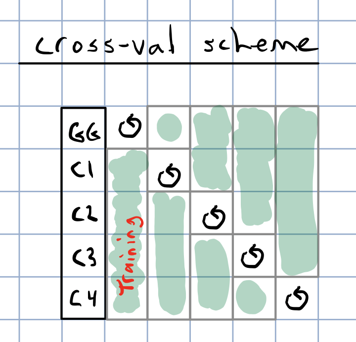

```{r setup, include=FALSE}
knitr::opts_chunk$set(echo = TRUE, message = FALSE, warning = F, tidy = T)
```

# Objective

Two training datasets versions:

1) studyYear>2012
2) allYears

Using newly imputed DArT+GBS sites to construct kinship.

Cross-validate the entire TP for Ismail's desired traits. 
Isolate sets of folds within different chunks of the TP:

- GG, TMS13, TMS14, TMS15, TMS18 (Ikenne CET only)

See code below and a diagram in the results section below that for more detail. 




# Make a kinship matrix

## Read and process dosages
```{r, eval=F}
library(tidyverse); library(magrittr); library(furrr); library(data.table)
options(mc.cores=18)
plan(multiprocess)
snps<-tibble(Chr=1:18) %>%
    mutate(raw=future_pmap(.,function(Chr,...){
      # NOTE: The filepath here directs to a directory on cbsurobbins.biohpc.cornell.edu
      # It is too big to put on GitHub
      # To do list is to figure out best-practice for sharing
        filename<-paste0("/workdir/marnin/nextgenImputation2019/ImputationStageII_71219/chr",Chr,
                         "_ImputationReferencePanel_StageIIpartI_72219.raw") 
        snps<-fread(filename,
                    stringsAsFactors = F) %>% 
            as_tibble
        return(snps) }))
# BLUPs pre-outlier removal
asModelsFit<-readRDS(file="data/iita_blupsForCrossVal_72619.rds")
clonesWithBLUPs<-asModelsFit %>% unnest(blups) %$% unique(GID)
```
Subset to clones with BLUPs only.  
```{r, eval=F}
snps %<>%
  mutate(raw=map(raw,function(raw){
    out<-raw %>% 
      as.data.frame %>% 
      column_to_rownames(var = "IID") %>% 
      dplyr::select(-FID,-PAT,-MAT,-SEX,-PHENOTYPE) %>% 
      as.matrix %>% 
      .[rownames(.) %in% clonesWithBLUPs,];
    return(out) }))
```
Concatenate per-chromosome dosage matrices. 
```{r, eval=F}
snps<-reduce(snps$raw,cbind)
dim(snps) # [1]  6629 84957
```
Subset the BLUPs to genotyped-clones only. 
```{r, eval=F}
asModelsFit %<>%
      mutate(blups=map(blups,~filter(.,GID %in% rownames(snps))))
asModelsFit %>% 
      mutate(Ntrain=map_dbl(blups,nrow)) %>% 
      select(Trait,Dataset,H2,Ntrain) %>% as.data.frame
```

## MAF>1% filter

Remove SNPs with minor allele frequency (MAF) less than 0.01
```{r, eval=F}
maf_filter<-function(snps,thresh){
    freq<-colMeans(snps, na.rm=T)/2; maf<-freq;
    maf[which(maf > 0.5)]<-1-maf[which(maf > 0.5)]
    snps1<-snps[,which(maf>thresh)];
    return(snps1) }
snps %<>% maf_filter(.,0.01)
dim(snps) # [1]  6629 82992
```
Save filtered dosage matrix for future purposes.  
Note filepath is to a non-public location, for the time being. 
```{r, eval=F}
saveRDS(snps,file=paste0("/workdir/marnin/IITA_2019GS/DosageMatrix_IITA_TrainingPop_72619.rds"))
```

## Construct kinship
```{r, eval=F}
library(tidyverse); library(magrittr); library(rrBLUP)
snps<-readRDS(file=paste0("/workdir/marnin/IITA_2019GS/DosageMatrix_IITA_TrainingPop_72619.rds"))
K<-rrBLUP::A.mat(snps-1)
saveRDS(K,file=paste0("data/",
                      "Kinship_IITA_TrainingPop_72619.rds"))
rm(snps); gc()
```

# Set-up training data
```{r, eval=F}
rm(list=ls()); gc()
library(tidyverse); library(magrittr); 
blups<-readRDS(file="data/iita_blupsForCrossVal_72619.rds")
K<-readRDS(file=paste0("/workdir/IITA_2019GS/Kinship_IITA_TrainingPop_72619.rds"))
blups %<>%
      rename(trainingData=blups) %>% 
      mutate(trainingData=map(trainingData,~filter(.,GID %in% rownames(K))))
tms13f<-rownames(K) %>% grep("TMS13F|2013_",.,value = T); length(tms13f) # 2395
tms14f<-rownames(K) %>% grep("TMS14F",.,value = T); length(tms14f) # 2171
tms15f<-rownames(K) %>% grep("TMS15F",.,value = T); length(tms15f) # 835
gg<-setdiff(rownames(K),c(tms13f,tms14f,tms15f)); length(gg) # 1228 (not strictly gg)

blups %<>%
    mutate(seed_of_seeds=1:n(),
           seeds=map(seed_of_seeds,function(seed_of_seeds,reps=5){ 
               set.seed(seed_of_seeds); 
               outSeeds<-sample(1:1000,size = reps,replace = F); 
               return(outSeeds) }))
blups %<>%
      select(-varcomp); gc()
```
Create an directory for the output
```{bash, eval=F}
mkdir /workdir/IITA_2019GS/CrossVal_72719
```
# Cross-validation function 

The version write output to disk to save RAM 

For each Trait-Dataset combination, run 5 reps of 5-fold cross-validation. 

```{r, eval=F}
# trainingData<-blups$trainingData[[1]]; seeds<-blups$seeds[[1]]; nfolds<-5; reps<-5;
crossValidateFunc<-function(Trait,Dataset,trainingData,seeds,nfolds=5,reps=5,ncores=40,...){
      trntstdata<-trainingData %>% 
            filter(GID %in% rownames(K))
      K1<-K[rownames(K) %in% trntstdata$GID,
            rownames(K) %in% trntstdata$GID]
      rm(K,trainingData); gc()
      # seed<-seeds[[1]]
      # Nfolds=nfolds
      makeFolds<-function(Nfolds=nfolds,seed){
            genotypes<-rownames(K1)
            
            set.seed(seed)
            seed_per_group<-sample(1:10000,size = 4,replace = FALSE)
      
            set.seed(seed_per_group[1])
            FoldsThisRep_tms15<-tibble(CLONE=genotypes[genotypes %in% tms15f],
                                       Group="TMS15F") %>% 
                  mutate(Folds=sample(1:Nfolds,nrow(.),replace=T)) %>% 
                  arrange(Folds) %>% 
                  group_by(Group,Folds) %>% 
                  nest(.key = Test)
            set.seed(seed_per_group[2])
            FoldsThisRep_tms14<-tibble(CLONE=genotypes[genotypes %in% tms14f],
                                       Group="TMS14F") %>% 
                  mutate(Folds=sample(1:Nfolds,nrow(.),replace=T)) %>% 
                  arrange(Folds) %>% 
                  group_by(Group,Folds) %>% 
                  nest(.key = Test)
            set.seed(seed_per_group[3])
            FoldsThisRep_tms13<-tibble(CLONE=genotypes[genotypes %in% tms13f],
                                       Group="TMS13F") %>% 
                  mutate(Folds=sample(1:Nfolds,nrow(.),replace=T)) %>% 
                  arrange(Folds) %>% 
                  group_by(Group,Folds) %>% 
                  nest(.key = Test)
            set.seed(seed_per_group[4])
            FoldsThisRep_gg<-tibble(CLONE=genotypes[genotypes %in% gg],
                                       Group="GGetc") %>% 
                  mutate(Folds=sample(1:Nfolds,nrow(.),replace=T)) %>% 
                  arrange(Folds) %>% 
                  group_by(Group,Folds) %>% 
                  nest(.key = Test)
           FoldsThisRep<-bind_rows(FoldsThisRep_tms15,FoldsThisRep_tms14) %>% 
                  bind_rows(FoldsThisRep_tms13) %>% 
                  bind_rows(FoldsThisRep_gg) %>% 
                  mutate(Test=map(Test,~.$CLONE),
                         Train=map(Test,~genotypes[!genotypes %in% .]))
            return(FoldsThisRep) }
      
    crossval<-tibble(Rep=1:reps,seed=unlist(seeds)) %>% 
        mutate(Folds=map2(Rep,seed,~makeFolds(Nfolds=nfolds,seed=.y))) %>% 
        unnest()

    #Test<-crossval$Test[[1]]; Train<-crossval$Train[[1]]
    crossValidate<-function(Test,Train){ 
      train<-Train
      test<-Test
      trainingdata<-trntstdata %>% 
        filter(GID %in% train) %>% 
        mutate(GID=factor(GID,levels=rownames(K1)))
       
      require(sommer)
      proctime<-proc.time()
      fit <- mmer(fixed = drgBLUP ~1,
                  random = ~vs(GID,Gu=K1),
                  weights = WT,
                  data=trainingdata) 
      proc.time()-proctime
      
      x<-fit$U$`u:GID`$drgBLUP 
      gebvs<-tibble(GID=names(x),
                    GEBV=as.numeric(x))
      
      accuracy<-gebvs %>% 
            filter(GID %in% test) %>% 
            left_join(
                  trntstdata %>% 
                        dplyr::select(GID,BLUP) %>% 
                        filter(GID %in% test)) %$% 
            cor(GEBV,BLUP, use='complete.obs') 
    return(accuracy)
    }
    
    require(furrr)
    options(mc.cores=ncores)
    plan(multiprocess)
    crossval<-crossval %>% 
          mutate(accuracy=future_map2(Test,Train,~crossValidate(Test=.x,Train=.y)))
    saveRDS(crossval,file=paste0("output/CrossVal_72719/",
                                 "CrossVal_",Trait,"_",Dataset,"_72719.rds"))
    rm(list=ls()); gc() 
    }
```
# Run CV on two servers
## cbsumm21 (40)
```{r, eval=F}
blups %>% 
      slice(1:23) %>% 
      mutate(CVaccuracy=pmap(.,crossValidateFunc))
```
## cbsu30 (40)
```{r, eval=F}
blups %>% 
      slice(24:46) %>% 
      mutate(CVaccuracy=pmap(.,crossValidateFunc))
```

# Results
```{r, eval=T}
#rm(list=ls());gc()
library(tidyverse); 
library(magrittr); 
library(cowplot); 
files<-list.files("output/CrossVal_72719/")
pathway<-"output/CrossVal_72719/"
cv<-tibble(Files=files) %>% 
  mutate(cvResults=map(Files,~readRDS(paste0(pathway,.))))
cv %<>% 
  mutate(Files=gsub(pathway,"",Files),
         Files=gsub("_72719.rds","",Files),
         Dataset=ifelse(grepl("2013toPresent",Files),"2013toPresent","HistoricalDataIncluded"),
         Files=gsub("_2013toPresent","",Files),
         Files=gsub("_HistoricalDataIncluded","",Files)) %>% 
  rename(Trait=Files) %>% 
  unnest(cols = cvResults) %>% 
  mutate(Ntrain=map_dbl(Train,~length(.)),
         Ntest=map_dbl(Test,~length(.))) %>%
  select(-Test,-Train) %>%
  unnest(cols = accuracy)
```

## Figure 1

This plot shows only the analyses with all historical data included.
It aims to compare the accuracy within each genetic group.

```{r, eval=T, out.width='100%'}
library(viridis)
cv %>% filter(Dataset=="HistoricalDataIncluded") %>% 
      ggplot(.,aes(x=Trait,y=accuracy,fill=Group)) + 
      geom_boxplot() + 
      #facet_wrap(~Group,nrow=1) +
      geom_hline(yintercept = 0,color='darkred',size=1.25) + 
      theme_bw() + 
      theme(axis.text.x = element_text(angle=90,face='bold')) +
      scale_fill_viridis_d()
```

## Figure 2

This plot shows only the analyses excluding historical data
```{r, eval=T, out.width='100%'}
library(viridis)
cv %>% filter(Dataset!="HistoricalDataIncluded") %>% 
      ggplot(.,aes(x=Trait,y=accuracy,fill=Group)) + 
      geom_boxplot() + 
      #facet_wrap(~Group,nrow=1) +
      geom_hline(yintercept = 0,color='darkred',size=1.25) + 
      theme_bw() + 
      theme(axis.text.x = element_text(angle=90,face='bold')) +
      scale_fill_viridis_d()
```

## Figure 3

This plot aims to compare training on all historical-included to using only 2013toPresent data.
Though the advantage is not huge, I see a small benefit or no cost to including historical data. Thoughts?
One thing to note: You can see that the advantage of historical data is, not suprisingly, most sig. in the Genetic Gain. Phenotyping your clones continuously for 20 years works.

```{r, eval=T, fig.width=9, fig.height=6}
library(viridis)
cv %>% 
      ggplot(.,aes(x=Trait,y=accuracy,fill=Dataset)) + 
      geom_boxplot() + 
      facet_wrap(~Group,nrow=1) +
      geom_hline(yintercept = 0,color='darkred',size=1.25) + 
      theme_bw() + 
      theme(axis.text.x = element_text(angle=90,size = 10),
            legend.position = "top") +
      scale_fill_viridis_d()
```

## Figure 4

Or again, if you don’t want to compare the genetic groups, this is just lumping everything per trait, historical data-included.

```{r, eval=T, fig.width=9, fig.height=6}
library(viridis)
cv %>% filter(Dataset=="HistoricalDataIncluded") %>% 
      ggplot(.,aes(x=Trait,y=accuracy,fill=Trait)) + 
      geom_boxplot() + 
      #facet_wrap(~Group,nrow=1) +
      geom_hline(yintercept = 0,color='darkred',size=1.25) + 
      theme_bw() + 
      theme(axis.text.x = element_text(angle=90),
            legend.position = 'none') +
      scale_fill_viridis_d()
```

## Figure 5

Adjust the y-limit from Figure 4
```{r, eval=T, fig.width=9, fig.height=6}
library(viridis)
cv %>% filter(Dataset=="HistoricalDataIncluded") %>% 
      ggplot(.,aes(x=Trait,y=accuracy,fill=Trait)) + 
      geom_boxplot() + 
      #facet_wrap(~Group,nrow=1) +
      geom_hline(yintercept = 0,color='darkred',size=1.25) + 
      theme_bw() + 
      theme(axis.text.x = element_text(angle=90),
            legend.position = 'none') + lims(y=c(0,1)) + 
      scale_fill_viridis_d()
```

# Next step

[Stage II: Cross-validation Run 2](IITA_StageII_CheckPredictionAccuracy2.html)
